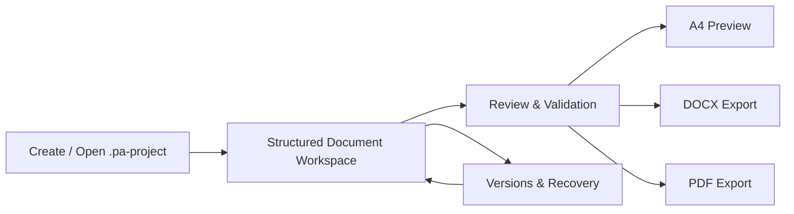

# TA Builder

> A focused Windows desktop workspace for writing **Proposal Proyek Akhir** through **Final Report** with structured academic documents, consistent preview, and export-ready DOCX/PDF.

[](https://github.com/zyxel-lyn/TA-Builder/releases/latest)
[](https://github.com/zyxel-lyn/TA-Builder/releases/latest)
[](https://github.com/zyxel-lyn/TA-Builder/releases)
[](https://github.com/zyxel-lyn/TA-Builder/releases/latest)

---

## What is TA Builder?

TA Builder membantu mahasiswa menyusun dokumen akademik secara terstruktur tanpa harus menjaga format secara manual dari halaman ke halaman.

Fokus utama aplikasi:

- Proposal Proyek Akhir sampai Final Report dalam satu project.
- BAB, subbab, subsubbab, dan lampiran yang fleksibel.
- Preview A4 yang konsisten dengan hasil export.
- Export DOCX dan PDF dari sumber dokumen yang sama.
- Project lokal dengan file `.pa-project`.
- Versioning, recovery, integrity checks, dan review gate.
- Lembar Pengesahan dapat diaktifkan/nonaktifkan sesuai kebutuhan dokumen.
- Format Cover, Pengesahan, dan Kata Pengantar yang terkontrol.

## Latest release

### TA Builder v1.1.3

**Windows x64**

[Download TA-Builder-v1.1.3-Windows-x64.zip](https://github.com/zyxel-lyn/TA-Builder/releases/download/v1.1.3/TA-Builder-v1.1.3-Windows-x64.zip)

SHA-256:

```text
D3D1C1D70F947F0207F728082BF760AB1FB89B5300B4D7F4ECA672A94BA5896F
```

Release page:

https://github.com/zyxel-lyn/TA-Builder/releases/tag/v1.1.3

## Installation

### Recommended

1. Download the latest Windows x64 ZIP from **Releases**.
2. Extract the ZIP.
3. Right-click PowerShell and run as **Administrator**.
4. Run:

```powershell
Set-ExecutionPolicy -Scope Process Bypass
.\Install-PA-Builder.ps1
```

5. Open **PA Builder** from the Windows Start Menu.

The distributed bundle contains:

- signed MSIX package;
- public signing certificate;
- installer/uninstaller scripts;
- sample project;
- checksum manifest;
- release notes;
- recovery guide.

The bundle does **not** contain the private signing key.

For detailed instructions, see [INSTALL.md](INSTALL.md).

## Quick install helper

This repository also provides a small helper that downloads the latest public release, verifies the SHA-256 checksum, extracts it, and launches the bundled installer.

```powershell
Set-ExecutionPolicy -Scope Process Bypass
.\scripts\Install-TA-Builder.ps1
```

Review the script before running it if you prefer to audit every installation step.

## v1.1.3 highlights

- Kata Pengantar closing block now keeps exactly one full blank line between the Banda Aceh/date line and the student name.
- Student name underline and NPM line remain unchanged.
- The spacing contract is identical in DOCX and PDF/Preview.
- Fresh Microsoft Word runtime validation confirmed two line breaks after the location/date, producing one visual blank line.
- PDF layout extraction independently confirmed: date line → empty line → student name → NPM.
- v1.1.2 canonical front-matter order, Daftar Isi, Daftar Gambar, and Daftar Tabel behavior remain intact.
- `.pa-project` schema, ProjectId semantics, academic workflow, and package identity remain compatible.

## Product flow



## Repository model

This is the **public distribution and support repository**.

The production source repository is not published here. This repository intentionally contains only public-facing documentation, issue templates, release tooling, checksum helpers, and downloadable release artifacts.

That separation keeps the public download surface small while preventing internal build/signing material from being exposed.

## Verify a download

Download both:

- `TA-Builder-v1.1.3-Windows-x64.zip`
- `SHA256SUMS.txt`

Then run:

```powershell
.\scripts\Verify-TA-Builder.ps1 \
  -ZipPath .\TA-Builder-v1.1.3-Windows-x64.zip \
  -ChecksumsPath .\SHA256SUMS.txt
```

Expected result:

```text
VERIFY=PASS
```

## Requirements

- Windows 10/11 x64
- Administrator access for MSIX certificate trust/install
- PowerShell 5.1 or newer

## Issues

Found a bug? Open an issue and include:

- TA Builder version;
- Windows version;
- steps to reproduce;
- expected behavior;
- actual behavior;
- screenshots/logs when safe to share.

Use the repository issue template so reports remain reproducible.

## Security

Do not publish passwords, tokens, signing keys, private documents, or personally sensitive project files in issues.

See [SECURITY.md](SECURITY.md).

---

**TA Builder** — structured academic writing, local-first.
